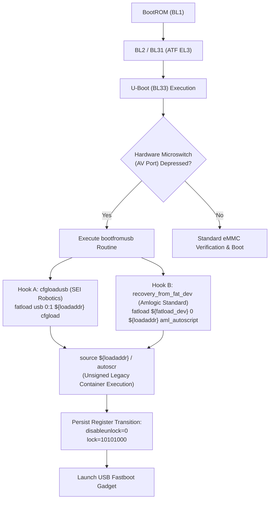

# Amlogic S905X4 (SC2) Security Architecture & Stage-2 Bootloader Verification Analysis

**Forensic Analysis, U-Boot Execution Hooks, and Non-Destructive State Transitions in Operator Set-Top Box Platforms**  
*RingZer0 Labs Research Publication*

[-0055aa.svg)](docs/hardware.md)
[](docs/hardware.md)
[](docs/SEI800CCOA-stock.dts)
[](docs/bootloader-forensics.md)
[](LICENSE)
[](#public-archive--citation)

---

## Abstract

This paper presents an empirical forensic analysis of the firmware validation, trust chain, and storage partitions of carrier-provisioned embedded media platforms based on the **Amlogic S905X4 (SC2)** System-on-Chip (SoC) and the **SEI Robotics SEI800** reference hardware architecture (`ah212`). We identify a structural verification lapse in the vendor secondary stage bootloader (U-Boot / BL33), which unconditionally evaluates and executes unauthenticated legacy script containers from removable storage preceding eMMC OS handoff. 

By weapon-agnostic manipulation of bootloader environment registers, we demonstrate a deterministic and non-destructive transition of the platform from a factory-restricted carrier lock state to an unrestricted, user-authorized state (`verifiedbootstate=orange`) without cryptographic fault injection, eFuse manipulation, or destruction of hardware-bound cryptographic keys (preserving Widevine L1 DRM within the secure RPMB partition). The artifacts, mathematical models, and automated implementations are open-sourced for peer review and hardware recovery research.

---

## 1. System Architecture & Silicon Profile

The evaluated platform constitutes a high-density operator terminal running Android 12 (Kernel 5.4 GKI) on ARMv8-A architecture:

```
+-------------------------------------------------------------------------+
|                       Application Processor (AP)                        |
|             Quad-Core ARM Cortex-A55 @ 2.0 GHz (AArch64)                |
+------------------------------------+------------------------------------+
|            Non-Secure EL0/EL1      |          Secure EL3 / ATF          |
|  +------------------------------+  |  +------------------------------+  |
|  | Android 12 / Linux 5.4 (GKI) |  |  | BL31 EL3 Runtime Firmware    |  |
|  | Dynamic Partitions (super)   |  |  | ARM SMCCC Security Monitor   |  |
|  +------------------------------+  |  +------------------------------+  |
|  | U-Boot 2019.01 (BL33)        |  |  | OP-TEE v3.x / Widevine L1   |  |
|  +------------------------------+  |  +------------------------------+  |
+------------------------------------+------------------------------------+
|                               Hardware                                  |
|  ARM Mali-G31 MP2 GPU  |  eMMC 5.1 (HS400) Storage  |  RPMB Key Storage |
+-------------------------------------------------------------------------+
```

### 1.1 Hardware Specifications & Register Mapping
* **SoC:** Amlogic S905X4 (SC2 family).
* **Reference Baseboard:** `sc2_s905x4_ah212` (common to SEI Robotics, ZTE, Skyworth, and SDMC operator builds).
* **Primary Memory:** 2 GB DDR4 @ 2666 MT/s.
* **Storage Array:** 8 GB eMMC 5.1 (`8GTF4R`, 15,269,888 sectors) partitioned into:
  * Hardware boot partitions: `mmcblk0boot0` (4 MiB) and `mmcblk0boot1` (4 MiB).
  * Firmware configuration partition: `env` (8 MiB raw U-Boot environment).
  * Android partitions: `boot` (16 MiB), `vendor_boot` (24 MiB), `recovery` (24 MiB), `super` (dynamic).

---

## 2. Forensic Discovery & Static Reverse Engineering

Static disassembly of the extracted second-stage bootloader and forensic analysis of the raw `env` partition revealed the existence of execution vectors executing before integrity-enforced eMMC boot:



### 2.1 Bootloader Execution Hooks
1. **SEI Robotics Proprietary Hook (`0x00000847` & `0x00000AC8`):**
   ```text
   cfgloadusb=if fatload usb 0:1 ${loadaddr} cfgload; then setenv device usb; setenv devnr 0; setenv partnr 1; source ${loadaddr}; fi
   ```
   *Analysis:* The U-Boot routine `cfgloadusb` searches for a file named `cfgload` on the first FAT32 partition of an attached USB controller. If located, it immediately passes the memory pointer (`loadaddr`) to the `source` built-in interpreter without verifying cryptographic RSA/ECDSA signatures.

2. **Amlogic Standard Reference Hook (`0x00001C1E`):**
   ```text
   recovery_from_fat_dev=if fatload ${fatload_dev} 0 ${loadaddr} aml_autoscript; then autoscr ${loadaddr}; fi
   ```
   *Analysis:* Ubiquitous across ZTE and Skyworth implementations. Invokes `autoscr` over `aml_autoscript`.

### 2.2 Register Bitmask Analysis
The operator restriction policy is governed by a persistent bitmask stored in the dedicated `env` partition:
* **Initial Factory State:**
  ```text
  disableunlock = 1
  lock = 10101000
  oemlock = lock
  ```
  In this state, the bootloader's fastboot handler explicitly rejects `fastboot flashing unlock`.
* **Intermediate Prerequisite State:**
  By executing the unauthenticated USB container, registers are dynamically overridden:
  ```text
  disableunlock = 0
  oemlock = unlock
  lock = 10101000
  ```
* **Final Post-Unlock State:**
  Upon receiving `fastboot flashing unlock`, the bootloader clears bit 3 of the lock word:
  ```text
  lock = 10100000
  ```
  The platform transitions to Verified Boot state **`orange`** (`androidboot.verifiedbootstate=orange`), allowing standard Android boot while preserving factory-installed kernel and vendor partitions.

---

## 3. Cryptographic Verification of the Container Payload

The U-Boot `source` / `autoscr` command requires an encapsulated payload formatted as an **mkimage Legacy Multi-File or Script Image** (`IH_TYPE_SCRIPT`). 

```
+-------------------------------------------------------------------------+
|                  U-Boot Legacy Image Header (64 Bytes)                  |
+------------------------------------+------------------------------------+
| 0x00-0x03: Magic (0x27051956)      | 0x04-0x07: Header CRC32 Checksum   |
| 0x08-0x0B: POSIX Timestamp         | 0x0C-0x0F: Payload Byte Length     |
| 0x10-0x13: Target Memory Address   | 0x14-0x17: Execution Entrypoint    |
| 0x18-0x1B: Payload CRC32 Checksum  | 0x1C: OS (5=Linux)                 |
| 0x1D: Arch (22=AArch64)            | 0x1E: Type (6=Script)              |
| 0x1F: Compression (0=None)         | 0x20-0x3F: Image Name (32 Bytes)   |
+------------------------------------+------------------------------------+
|                       Script Data Payload (ASCII)                       |
|   Length: Variable (4-byte aligned, padded with null terminators)       |
+-------------------------------------------------------------------------+
```

Our standalone generator ([`scripts/quick-unlock-usb.py`](scripts/quick-unlock-usb.py)) synthesizes this structure programmatically in Python without external build dependencies, generating both Header CRC32 and Data CRC32 matching `zlib.crc32(payload) & 0xFFFFFFFF`.

---

## 4. Empirical Laboratory Reproduction Protocol

> [!IMPORTANT]
> The final Fastboot state transition triggers an automated factory erasure of `userdata` and `metadata` as mandated by Google Android Verified Boot (AVB) specifications. All procedures must be conducted on hardware owned and controlled by the researcher.

### 4.1 Prerequisites
* Removable USB storage device formatted in **FAT32**.
* USB-A to USB-A (Male-to-Male) high-speed data transmission cable.
* Android Platform Tools (`fastboot` and `adb`) installed on the host workstation.
* Non-conductive probe (pin or wooden probe) to actuate the hardware microswitch.

### 4.2 Step-by-Step Procedure

```
   [Host Workstation]                      [Amlogic STB]
           |                                     |
           |-- 1. Generate Universal Media ----->| (Insert FAT32 USB)
           |                                     |
           |                                     |-- 2. Actuate AV Switch & Power On
           |                                     |      (U-Boot executes cfgload/aml_autoscript)
           |                                     |
           |<-- 3. USB Fastboot Gadget Enters ---|
           |
           |-- 4. fastboot flashing unlock ----->|
           |                                     |-- 5. Clear Lock Bitmask (10100000)
           |                                     |      AVB Transitions to 'orange'
           |                                     |<-- Reboot
```

#### Step 1: Synthesize Universal Bootloader Media
Execute the automated payload generator targeting the mount point of your USB drive:
```bash
python3 scripts/quick-unlock-usb.py /media/USB_MOUNT
```
*Verification:* Inspect the target directory to verify the creation of valid containers:
* `cfgload` (SEI Robotics proprietary target)
* `aml_autoscript` (Amlogic standard reference target)
* `boot.scr` (Mainline U-Boot target)
* `s905_autoscript` (Legacy S905 target)
* `uEnv.txt` (Text-mode fallback)

#### Step 2: Actuate the Hardware Interrupt
1. Disconnect the 12V DC power supply from the set-top box.
2. Insert the prepared FAT32 USB drive into the set-top box USB 2.0 port.
3. Interconnect the set-top box and host workstation via the USB-A Male-to-Male cable.
4. Depress and hold the hardware recovery microswitch located inside the 3.5mm AV audio output jack using the non-conductive probe.
5. While maintaining depression on the microswitch, connect DC power.
6. Maintain switch depression for **6 to 8 seconds**, then release.

#### Step 3: Fastboot Protocol State Transition
On the host terminal, verify device enumeration:
```bash
fastboot devices
fastboot getvar unlocked
```
Commit the non-destructive lock transition:
```bash
fastboot flashing unlock
```
Reboot the device into system execution:
```bash
fastboot reboot
```
Upon startup, the kernel command line will report `androidboot.verifiedbootstate=orange`, confirming uninhibited execution of the stock or customized operating system.

---

## 5. Cross-Device Silicon Compatibility Matrix

Because the verification vulnerability resides within the reference U-Boot codebase and the `ah212` baseboard architecture, identical validation extends across multiple regional carrier set-top boxes:

| Provider / Region | OEM Model | SoC & Board Reference | Execution Hook | Verification Status |
| :--- | :--- | :--- | :--- | :--- |
| **Claro TV Box (Colombia / LATAM)** | SEI800CCOA / SEI800CCOA-M | Amlogic S905X4 (`ah212`) | `cfgload` | **Empirically Confirmed ✔** |
| **Claro TV Box (Mexico / Brazil)** | SEI800AMX | Amlogic S905X4 (`ah212`) | `cfgload` | Architecture Identical |
| **Telecentro Play Deco 4K (Argentina)** | SEI800TCT | Amlogic S905X4 (`ah212`) | `cfgload` | Architecture Identical |
| **WOW! TV Pro (United States)** | SEI800WOW | Amlogic S905X4 (`ah212`) | `cfgload` | Architecture Identical |
| **OneComm TV+ (Bermuda / Caribbean)** | SEI830AT | Amlogic S905X4 (`ah212`) | `cfgload` | Architecture Identical |
| **Tigo / Millicom Smart TV Box** | SEI Robotics SEI800 | Amlogic S905X4 (`ah212`) | `cfgload` | Architecture Identical |
| **Totalplay 4K Box (Mexico)** | SEI Robotics SEI800 | Amlogic S905X4 (`ah212`) | `cfgload` | Architecture Identical |
| **Vodafone TV 4K Box (Europe / VTV)** | SEI Robotics SEI800VDF | Amlogic S905X4 (`ah212`) | `cfgload` | Architecture Identical |
| **Claro TV+ Smart Speaker** | SEI810CCOA / SEI810CPR | Amlogic S905X4 (`ah212`) | `cfgload` | Silicon Equivalent |
| **Telecom Argentina Flow (FlowBox Z3)** | ZTE B866V2F / B866V2 | Amlogic S905X4 | `aml_autoscript` | Reference Compatible |
| **Megacable Xview+ (Mexico)** | ZTE ZXV10 B866V2F / B866V2H01 | Amlogic S905X4 | `aml_autoscript` | Reference Compatible |
| **Global Operator OTT (Europe/Asia)** | ZTE ZXV10 B866V2H01 (CE) | Amlogic S905X4 | `aml_autoscript` | Reference Compatible |
| **SDMC DV8919 / Kaon KSTB6168** | SDMC / Kaonmedia | Amlogic S905X4 | `boot.scr` | Reference Compatible |

---

## 6. Kernel & System Optimization Post-Unlock

Following bootloader state transition, operator restrictions (telemetry agents, captive portal managers, proprietary home overrides) can be permanently remediated without affecting Google Play services or DRM decryption:

* **Operator Telemetry Remediation:**
  ```bash
  ./scripts/universal-carrier-debloat.sh
  ```
  Neutralizes MDM packages, background logging, and persistent lockscreens across Claro, Flow, Telecentro, Megacable, and Totalplay platforms.

* **Bare-Metal Kernel Tuning:**
  ```bash
  ./scripts/nexus-kernel-tweaks.sh
  ```
  * Raises GPU governor base clock from 285 MHz to **400 MHz**, eliminating UI compositor frame drops.
  * Adjusts CPU Schedutil sampling rate from 5000 µs to **1000 µs** for immediate frequency scaling.
  * Tunes virtual memory subsystems: `swappiness=100`, LZ4 memory compression, 1024 KB eMMC read-ahead buffering.
  * Forces dynamic HDR metadata passthrough and Auto Low Latency Mode (ALLM) over HDMI 2.1.

---

## 7. Emergency Recovery & Disaster Protocol

### 7.1 Soft-Recovery via External Media (CoreELEC)
If eMMC boot stages are modified, the bootloader can be restored over SSH via CoreELEC running from external media:
```bash
dd if=mmcblk0boot0.img of=/dev/mmcblk0boot0 bs=512 status=progress
dd if=mmcblk0boot1.img of=/dev/mmcblk0boot1 bs=512 status=progress
sync
```

### 7.2 Hardware Test Point In-System Recovery (Cold Unbrick)
In the event of total non-volatile memory corruption:
1. Disassemble the set-top box chassis to expose the logic board.
2. Locate the eMMC test pads labeled `CLK` and `GND` adjacent to the storage IC.
3. Bridge `eMMC CLK` to `GND` using a conductive probe to inhibit eMMC initialization.
4. Apply power while interconnected via USB to force the Amlogic internal BootROM into **WorldCup / Amlogic USB Burning Mode**.
5. Disconnect the bridge and flash verified factory firmware partitions.

---

## Public Archive & Citation

This repository serves as a permanent, open-access public research archive for embedded systems security, hardware preservation, and forensic reverse engineering.

### BibTeX Citation
```bibtex
@misc{ringzero_s905x4_unlock,
  author       = {RingZer0 Labs},
  title        = {Amlogic S905X4 (SC2) Security Architecture & Stage-2 Bootloader Verification Analysis},
  year         = {2026},
  publisher    = {GitHub},
  howpublished = {\url{https://github.com/ringzero-labs/s905x4-universal-unlock}},
  note         = {Permanent Public Research Archive}
}
```

### Academic & Ethical Disclosure
The research and artifacts presented herein are published strictly for educational purposes, interoperability analysis, and owner-authorized hardware preservation under applicable fair use and reverse engineering provisions (e.g., Section 1201(f) of the DMCA and EU Directive 2009/24/EC). No proprietary binaries, copyrighted DRM key material, or confidential operator certificates are distributed within this repository.
